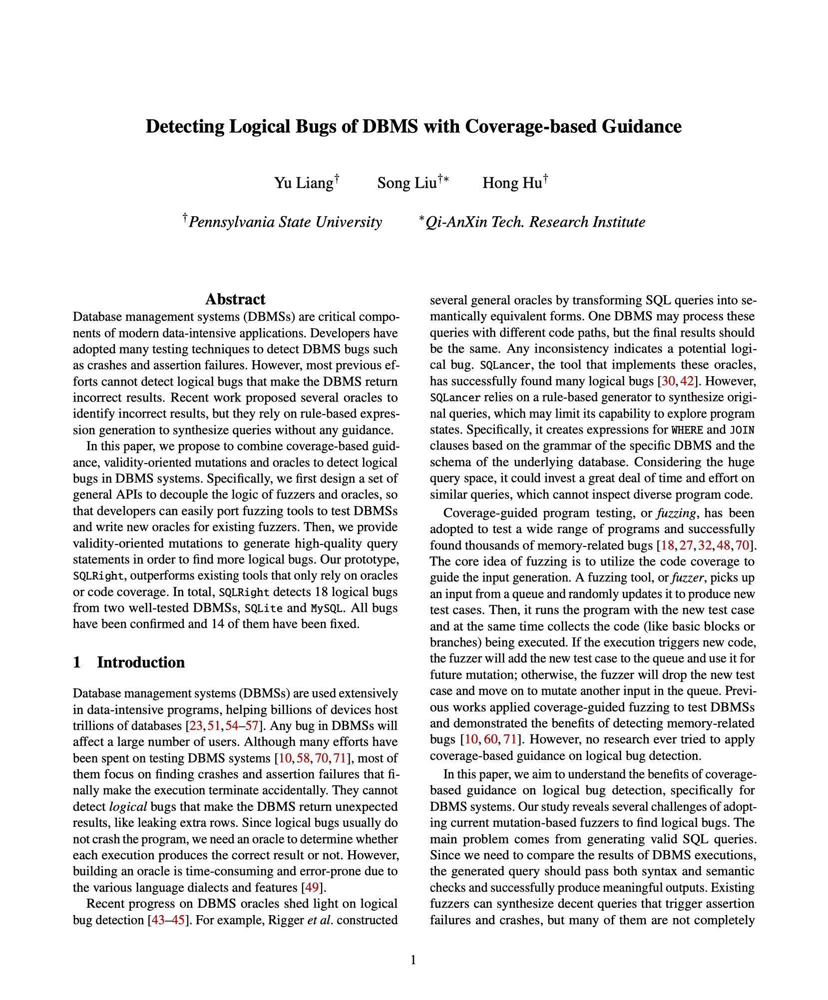
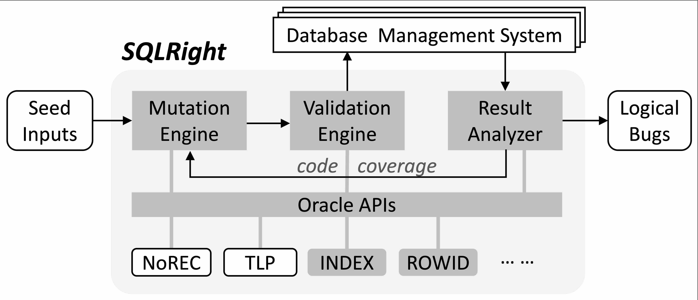

# SQLRight: a general platform to test DBMS logical bugs

<a href="Paper/paper.pdf"></a>

Version: 1.0\
Update: Jul 29, 2022\
Paper: Detecting Logical Bugs of DBMS with Coverage-based Guidance

Currently supported DBMS:
1. SQLite3
2. PostgreSQL
3. MySQL

<br/><br/>
## SQLRight Overview

`SQLRight` combines the coverage-based guidance, validity-oriented mutations and oracles to detect logical bugs for DBMS systems. `SQLRight` first mutates existing queries cooperatively. It inserts a set of oracle-required statements, and applies our validity-oriented mutations to improve the validity rate. Then, it sends the query to the oracle to create functionally equivalent query counterparts. `SQLRight` feeds all generated queries to the DBMS, and collects the execution results and the coverage information. After that, `SQLRight` invokes the oracle to compare the results of different queries to identify logical bugs. At last, it inserts the coverage-improving queries into the queue for future mutations.

The overview of `SQLRight` is illustrated by the diagram below.

<p align="center">

</p>

<br/><br/>
## Installation & Run

The Installation and Run instructions can be found in this [link](doc/install_n_run_steps.md).

<br/><br/>
## Authors

- Yu Liang yuliang@psu.edu
- Song Liu svl6237@psu.edu
- Hong Hu honghu@psu.edu

<br/><br/>
## Publications

```bib
Detecting Logical Bugs of DBMS with Coverage-based Guidance

@inproceedings {liang:sqlright,
title = {Detecting Logical Bugs of {DBMS} with Coverage-based Guidance},
booktitle = {31st USENIX Security Symposium (USENIX Security 22)},
year = {2022},
address = {Boston, MA},
url = {https://www.usenix.org/conference/usenixsecurity22/presentation/liang},
publisher = {USENIX Association},
month = aug,
}
```

